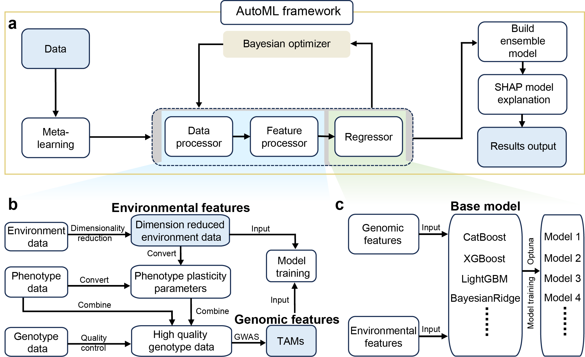

# AutoGS
[](./LICENSE) [](https://www.python.org/downloads/release/python-390/) []() [](https://doi.org/10.1002/advs.202412423) 
## Leveraging Automated Machine Learning for Environmental Dimension-Data Genetic Analysis and Genomic Prediction in Maize Hybrids

Automated Machine Learning for Environmental Data-Driven Genome Prediction.An automated machine learning framework integrating environmental and genomic data enhances genetic analysis and genomic prediction in maize. By leveraging dimension-reduced environmental parameters, it reveals trait-environment relationships and identifies genetic markers that govern phenotypic plasticity and genotype-by-environment interactions. The combined use of markers and environmental features improves genomic prediction accuracy, offering a scalable solution for developing climate-resilient maize varieties.

## Related Software and Tools

- [DNNGP](https://github.com/AIBreeding/DNNGP) – Deep neural network for genomic prediction.
- [EXGEP](https://github.com/AIBreeding/EXGEP) – A framework for predicting genotype-by-environment interactions using ensem)bles of explainable machine-learning models.
- [GxEtoolkit](https://github.com/AIBreeding/GxEtoolkit) – An automated and explainable machine learning framework for Genome Prediction.

## 🌐Operation systems 
   - **Windows** 
   
   - **Linux**

## 🏁Table of Contents
- [Getting started](#Getting-started)
- [Basic Usage](#Basic-Usage)

### Getting started

### Requirements
 
 - Python 3.9
 - pip

### Installation
Install packages:
1. Create a python environment.
```bash
conda create -n autogs python=3.9
conda activate autogs
```
2. Clone this repository and cd into it.
```bash
git clone https://github.com/AIBreeding/AutoGS.git
cd ./AutoGS
pip install -r requirements.txt
```
3. Test the AutoGS.
```bash
python test_autogs.py
```

### Basic Usage

```python
import os
import sys
import pprint
import sklearn
import pandas as pd
from scipy.stats import pearsonr
from matplotlib import pyplot as plt
from sklearn.preprocessing import StandardScaler
from autogs.data.tools.reg_metrics import (mae_score as mae,
                             mse_score as mse,
                             rmse_score as rmse,
                             r2_score as r2,
                             rmsle_score as rmsle,
                             mape_score as mape,
                             medae_score as medae,
                             pcc_score as pcc)

from autogs.model import RegAutoGS
from autogs.data import datautils

# read data
phen_file_path = "./dataset/trainset/Pheno/"
env_file_path = "./dataset/trainset/Env/"
geno_file_path = "./dataset/trainset/Geno/YI_All.vcf"
ref_path = "./docs/maizeRef(ALL).csv"
file_names = ["DEH1_2020", "DEH1_2021", "IAH2_2021", "IAH3_2021", "IAH4_2021", "WIH2_2020", "WIH2_2021"]

com_phen_data, com_env_data, dynamic_window_avg, env_transformed_data, \
gendata, PGE = datautils.process_data(phen_file_path, env_file_path, geno_file_path, ref_path, file_names)

# Access to phenotype （Yield_Mg_ha） and feature data （Gneo and Env）
columns_to_extract = [0, 1, 8] # Get Columns Env, Hybrid, and Yield_Mg_ha

columns_from_11_to_end = list(range(11, PGE.shape[1])) 
columns_indices = columns_to_extract + columns_from_11_to_end
extracted_columns = PGE.iloc[:, columns_indices]
extracted_columns = pd.DataFrame(extracted_columns.dropna().reset_index(drop=True))

snp = pd.DataFrame(extracted_columns.iloc[:,3:])
scaler = StandardScaler()
scaled_snp = scaler.fit_transform(snp)
X = pd.DataFrame(scaled_snp,columns=snp.columns)
y = extracted_columns['Yield_Mg_ha']
y = pd.core.series.Series(y)

# train AutoGS model for reg prediction
reg = RegAutoGS(
    y=y,
    X=X, 
    test_size=0.2, 
    n_splits=5, 
    n_trial=5, 
    reload_study=True,
    reload_trial=True, 
    write_folder=os.getcwd()+'/results/', 
    metric_optimise=r2, 
    metric_assess=[mae, mse, rmse, pcc, r2, rmsle, mape, medae],
    optimization_objective='maximize', 
    models_optimize=['LightGBM','XGBoost','CatBoost','BayesianRidge'], 
    models_assess=['LightGBM','XGBoost','CatBoost','BayesianRidge'], 
    early_stopping_rounds=5, 
    random_state=2024
)
reg.train() # train model
reg.CalSHAP(n_train_points=200,n_test_points=200,cluster=False) # AutoGS SHAP interaction
```
## Supported Evaluation Metrics
- `mae` — Mean Absolute Error (MAE)
- `mse` — Mean Squared Error (MSE)
- `rmse` — Root Mean Squared Error (RMSE)
- `r2` — R² Score (Coefficient of Determination)
- `rmsle` — Root Mean Squared Logarithmic Error (RMSLE)
- `mape` — Mean Absolute Percentage Error (MAPE)
- `medae` — Median Absolute Error (MEDAE)
- `pcc` — Pearson Correlation Coefficient (PCC)

## 🔍 Supported Base Regression Models

The AutoGS framework currently supports **28 base regression models**, including ensemble models, linear models, and other widely-used regressors. Each model can be optionally selected via the `selected_regressors` list.

### 🌲 Tree Models
- `DTR` – Decision Tree Regressor  
- `ETR` – Extra Trees Regressor  
- `LightGBM` – Light Gradient Boosting Machine  
- `XGBoost` – Extreme Gradient Boosting  
- `CatBoost` – Categorical Boosting  
- `AdaBoost` – Adaptive Boosting  
- `GBDT` – Gradient Boosting Decision Tree  
- `Bagging` – Bagging Regressor  
- `RF` – Random Forest Regressor  
- `HistGradientBoosting` – Histogram-based Gradient Boosting

### 📈 Linear and Sparse Models
- `BayesianRidge` – Bayesian Ridge Regression  
- `LassoLARS` – Lasso Least Angle Regression  
- `ElasticNet` – Elastic Net Regression  
- `SGD` – Stochastic Gradient Descent Regressor  
- `Linear` – Ordinary Least Squares Linear Regression  
- `Lasso` – Lasso Regression  
- `Ridge` – Ridge Regression  
- `OMP` – Orthogonal Matching Pursuit  
- `ARD` – Automatic Relevance Determination Regression  
- `PAR` – Passive Aggressive Regressor  
- `TheilSen` – Theil-Sen Estimator  
- `Huber` – Huber Regressor  
- `KernelRidge` – Kernel Ridge Regression  
- `RANSAC` – RANSAC (RANdom SAmple Consensus) Regressor

### 🔍 Other Models
- `KNN` – k-Nearest Neighbors Regressor  
- `SVR` – Support Vector Regressor  
- `Dummy` – Dummy Regressor (Baseline)  
- `MLP` – Multi-Layer Perceptron (Deep Neural Network)

#### 🍀For more detailed analysis steps see ***./test/test_autogs.ipynb***
#### ⚠️When using Jupyter Notebook/Lab, please ensure your Python environment is properly configured and added to Jupyter Notebook/Lab.
#### 👉Add the created autogs environment to Jupyter Notebook/Lab:
```python
conda create -n autogs python=3.9
conda activate autogs
conda install ipykernel
python -m ipykernel install --user --name autogs --display-name "autogs"
```

## 📚 Citation

You can read our paper explaining AutoGS [here](https://doi.org/10.1002/advs.202412423). 

He K, Yu T, Gao S, et al. Leveraging Automated Machine Learning for Environmental Data-Driven Genetic Analysis and Genomic Prediction in Maize Hybrids. *Adv Sci (Weinh)*, e2412423, 2025. https://doi.org/10.1002/advs.202412423


## 📜Copyright and License
This project is free to use for non-commercial purposes - see the [LICENSE](LICENSE) file for details.

## 👥Contacts
For more information, please contact with **Huihui Li** (lihuihui@caas.cn).
